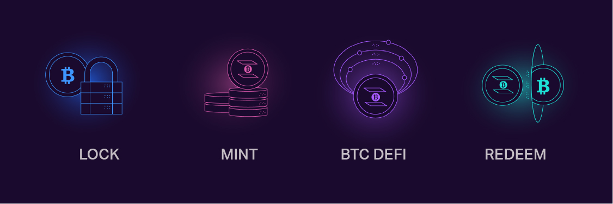
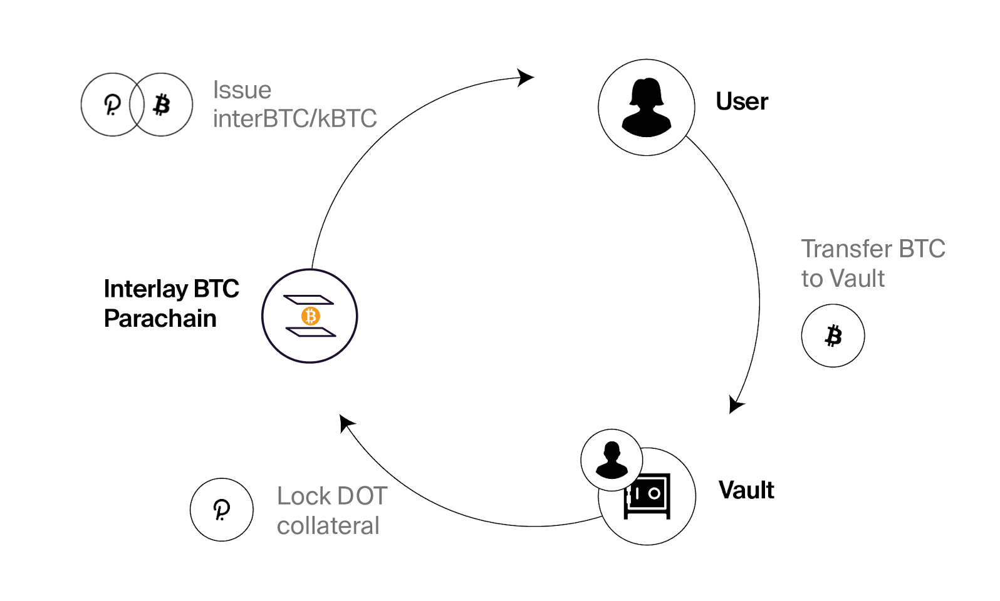
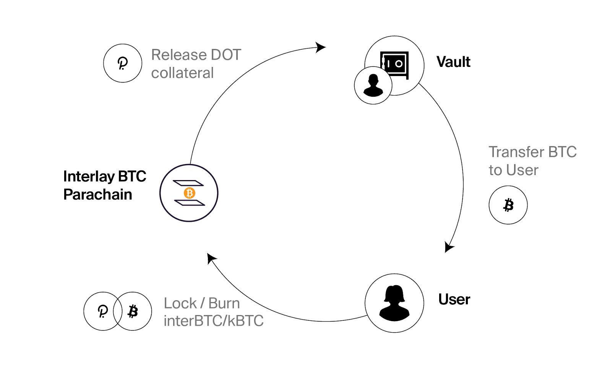
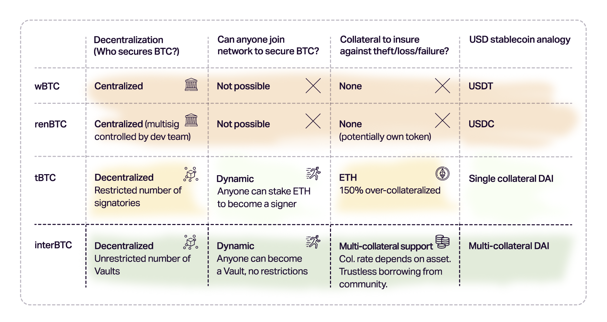

# interBTC: Bitcoin on Any Blockchain

## Overview

interBTC is a 1:1 Bitcoin backed asset that can be used to invest, earn and pay with BTC across the DeFi ecosystem on Polkadot, Ethereum, Cosmos and many more.

While interBTC exists, BTC held locked by collateralized Vaults on Bitcoin - individuals or service providers who

- (1) receive BTC into custody for safekeeping while interBTC exists,
- (2) lock collateral in a MakerDAO-inspired multi-collateral system to protect users against theft and loss of BTC.

The life-cycle of interBTC follows four main phases:

- **Lock:** Lock your BTC with a Vault. Pick one, or run your own. Your BTC is always safe and insured by Vault collateral.
- **Mint:** Get interBTC at a 1:1 ration to your locked BTC.
- **BTC DeFi:** Earn on your Bitcoin. Use interBTC as collateral, for lending, yield farming and more. On Polkadot, Kusama, Cosmos, Ethereum and other major DeFi platforms.
- **Redeem:** Redeem interBTC for actual BTC on Bitcoin - trustless and anytime you want.

## interBTC Security

What makes interBTC unique is the strict dedication to being trustless and decentralized.

- **Secured by Insurance**. Vaults lock collateral on the interBTC parachain in various digital assets - in a MakerDAO-inspired multi-collateral system. If Vaults misbehave, their collateral is slashed and users reimbursed. As a user, you only trust that Bitcoin and the DeFi platform you use are secure.

- **Radically Open**. Anyone can become a Vault and help secure interBTC, anytime. Yes, you can run your own Vault!

Hence, as a holder of interBTC, you have the following guarantee:

?> You can always redeem interBTC for BTC, or be reimbursed in the collateral currency at a beneficial rate.

In case the Vault misbehaves, you will be reimbursed from the Vault’s collateral and will end up making a *profitable* trade between BTC and the collateral asset(s).

At launch, collateral will be put down in DOT. In the mid/long run, this may be extended to stablecoins or token-sets to improve stability.

Summarizing, to trust interBTC, you only need to:

- *Trust that Bitcoin is secure*. Meaning: trust that Bitcoin blocks are final after X confirmations. The bridge will recommend a minimum of 6 confirmations, though users and apps are encouraged to set higher thresholds.
- *Trust that Polkadot / the chain you are using interBTC on is secure* . This assumption is made by all applications running on top of Polkadot.

?> interBTC is based on the XCLAIM framework - a peer-reviewed paper published at IEEE S&P, one of the most prestigious security conferences. You can [read the paper](https://eprint.iacr.org/2018/643.pdf) and checkout more of the [research published by the team behind Interlay](../about/research).

?> A more in-depth discussion about security can be found in the 200+ page [specification](https://spec.interlay.io/security_performance/liquidations.html).

## Network Participants

The design of interBTC has an emphasis on being open and permissionless. As such, any user can take up multiple roles at the same — but also leave the system whenever they wish. As such, to participate, you can choose from:

**Vaults:** collateralized intermediaries who hold BTC locked on Bitcoin. Any user can become a Vault by simply locking DOT collateral. The requirements are (1) a Bitcoin full node, (2) a Polkadot account and (3) liquidity in accepted collateral assets.

**Users:** there are two types of user on the BTC Parachain:

- **Liquidity Providers** lock BTC with Vaults to mint 1:1 backed *interBTC* on the Parachain. Requirement: (1) Bitcoin wallet and (2) Polkadot wallet.

- **End-Users** obtain interBTC from liquidity providers on Polkadot and use interBTC for payments and with applications. Requirements: Polkadot wallet.

Both can redeem owned interBTC for BTC at any time (requires a Bitcoin wallet).

**Collators** maintain the Interlay parachain by collecting transactions and producing security proofs which are verified by validators of the Polkadot Relay Chain. This is a Polkadot-specific role. [Read more about Collators in the Polkadot Wiki](https://wiki.polkadot.network/docs/learn-collator).

## Mint and Redeem

### Lock BTC to mint interBTC

A user (liquidity provider) mints new interBTC.

1. A Vault locks DOT as collateral with the interBTC bridge (the Interlay BTC Parachain).

1. A user creates an issue request with a collateralized Vault of his choosing. This reserves the Vault’s DOT collateral.

1. The user then sends BTC to the Vault.

1. The user proofs to the interBTC bridge that they sent the BTC to the vault (using a transaction inclusion proof against the BTC Relay).

1. Upon successful verification of the proof, the user mints interBTC and receives the tokens to his or her account balance.

 *High-level interBTC Issue process*

### Redeem interBTC for BTC

A user redeems interBTC for the equivalent amount of BTC or receives DOT as reimbursement.

1. To request a redeem, a user locks interBTC with the interBTC bridge (Interlay BTC Parachain).

1. The Parachain instructs a Vault to execute the redeem.

1. The Vault transfers the correct amount of BTC to the user.

1. To unlock the DOT collateral, the Vault submits a transaction inclusion proof to BTC-Relay.

1. If the proof is correct, the Parachain releases the Vault’s DOTs.

1. If no valid proof is provided on time, the Parachain slashes the Vault’s DOTs and reimburses the user at a beneficial exchange rate.

*High-level interBTC Redeem process*

## Collateral

To protect users against theft and loss of BTC, Vaults must lock collateral with the parachain, such that the value of the locked collateral is higher than the value of BTC locked with the Vault. To ensure Vaults have no incentive to steal user’s BTC, Vaults provide collateral in whitelisted assets that may be forfeit on exit - following a process similar to MakerDAO. To mitigate exchange rate fluctuations, interBTC employs over-collateralization and a multi-level collateral balancing scheme.

### Multi-Collateral System

Vault operators can freely choose to lock collateral in any of the assets whitelisted by [protocol governance](/getting-started/interbtc?id=governance). Each Vault is then associated with one specific collateral asset - and a single operator can maintain an unlimited amount of Vaults. Each collateral asset currency has a governance-set threshold determining how much of it can be locked as collateral in the system. Once this threshold is reached, new Vaults must pick from other collateral assets, or request to increase the threshold with protocol governance.

For users, the distinction between collaterals only becomes relevant when redeeming interBTC for BTC. Users can pick specific Vaults (one or multiple) for the redeem process - and are reimbursed in these specific Vault's collateral in case of failure.

Read more about the collateral system and re-balancing in the [Collateral section of the Vault page](/vault/overview?id=collateral).

### Liquidations

Vaults may be liquidated, i.e., have their collateral slashed and used to re-balance the system or to reimburse users, if:

- they fail to execute redeem requests,
- or are severly under-collateralized

Read more about liquidations in the [Liquidations section of the Vault page](/vault/overview?id=liquidations).

## KBTC: Canary Network

The flagship product of both Kintsugi and Interlay is “trustless Bitcoin for DeFi”.

KBTC on Kintsugi. interBTC on Interlay.

interBTC and KBTC are the same product at the core, with different parameterizations and risk profiles. Specifically, they will have different backing collaterals and security thresholds.

- **interBTC**. Only assets with large liquidity, which pass a rigorous security analysis, will be accepted as collateral for interBTC — similar to the MakerDAO process for DAI.

- **KBTC**, on the other hand, will be open to more experimental assets, including such that have lower liquidity — e.g. new forms of staking derivatives, LP tokens, young DeFi assets, perhaps even NFTs.

# interBTC vs Competitors

> *Rome was not built in one day* (proverb)

Centralized solutions are quick to build. As such, there exist a number of centralized and trusted wrapped Bitcoin providers, mostly operating on Ethereum (see [here](https://defipulse.com/btc) for a full list). However, Bitcoin was created with a vision of decentralization - and Interlay's mission is to ensure Bitcoin on other chains follows the same principles.

We provide a comparison below, using [this peer-reviewed cross-chain analysis framework](https://fc21.ifca.ai/papers/139.pdf):

 *InterBTC vs other, centralized wrapped Bitcoin systems.*

- **wBTC** was created by BitGo, a crypto-custody company. All BTC locked in wBTC is held by BitGo. You cannot freely join to become a BTC custodian (only BitGo has custody), and there is no insurance against failure. Users must trust BitGo. If BTC is lost, stolen or subject to regulatory events, wBTC will have no value backing it. If using USD stablecoins as analogy, the equivalent of wBTC is USDT/USDC.
- **renBTC** is a product of the Ren protocol, a crypto-startup that pivoted from Republic Protocol (a former protocol for dark pools, aka privacy-preserving trading). The BTC locked in renBTC is reportedly[1,](https://www.theblockcrypto.com/news+/76787/ren-bitcoin-wallet-decentralization)[2](https://decrypt.co/40110/massive-honeypot-ren-holds-100m-bitcoin-centralized-wallet) held in a multisig controlled by the Ren team. It appears that Ren's Dark Nodes (part of the former dark pool protocol) are not responsible for the BTC custody - and hence it is not possible for new users to help secure Ren's locked BTC, making it a centralized protocol. Just like with wBTC, there is no insurance to reimburse users if BTC is lost - users must simply trust the Ren team. Using the USD stablecoin analogy, the equivalent of renBTC is USDT/USDC.
- **tBTC v1** deployed an arguably decentralized version of BTC on Ethereum, similar to the design initially proposed in the XCLAIM paper (i.e., similar to interBTC). The BTC locked in tBTC is locked with Signers, who share control over the BTC keys using ECDSA threshold signatures. Signers provide collateral in ETH, which is used to reimburse users if BTC is lost. While at launch/during the initial period, not everyone could become a Signer, participation is open to everyone now. Due to tBTC v1 being a single-collateral system (ETH only), Signers [reportedly](https://tian7eth.medium.com/an-analyse-of-a-liquidation-of-tbtc-system-on-mainnet-82c70c9743e6) suffered from frequent liquidations, when the BTC/ETH price was volatile.**tBTC v2** is moving closer to the model that was envisioned (but not deployed) by Ren[3](https://evandrosaturnino.medium.com/why-does-a-trustless-bitcoin-in-defi-matter-77c0d544f0d9): BTC will be controlled by a group of 50-100 Signers sampled from a larger set. Rather than ETH, insurance will then be locked in KEEP tokens and cover a fraction of the locked BTC value.

**interBTC**, for comparison:

- **Anyone** can become a Vault in interBTC, making it fully **decentralized**;
- Vaults cannot prevent users from minting interBTC, making it **censorship resistant**
- Vaults lock **collateral in different assets (MakerDAO-like multi-collateral system)**, making the price peg **more stable** and avoiding frequent liquidations. This also allows to use interest bearing assets, such as liquid staking assets, as collatera, making interBTC **more capital efficient**.
- If BTC is lost or stolen, users are **reimbursed in collateral at a beneficial rate** (~110%), making it **financially trustless**.

Using the USD stablecoin analogy, **interBTC is comparable to multi-collateral DAI - but better, because interBTC can be redeemed for BTC but DAI cannot be redeemed for physical USD**. So, strictly speaking, interBTC is a Bitcoin stablecoin.
