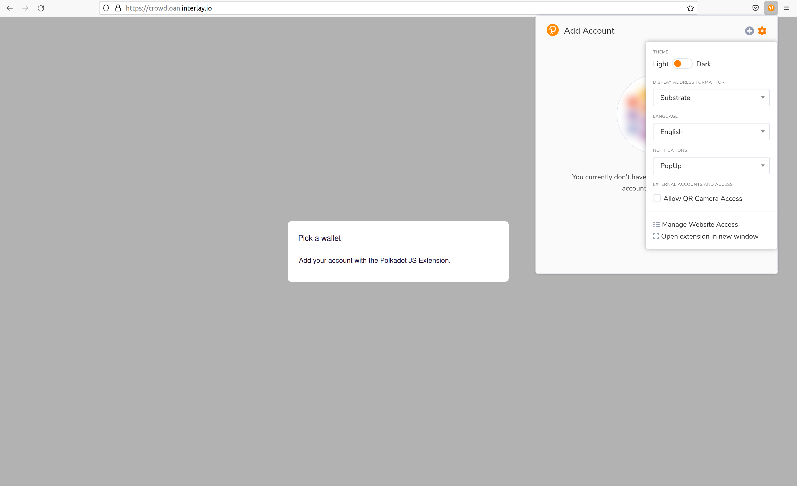
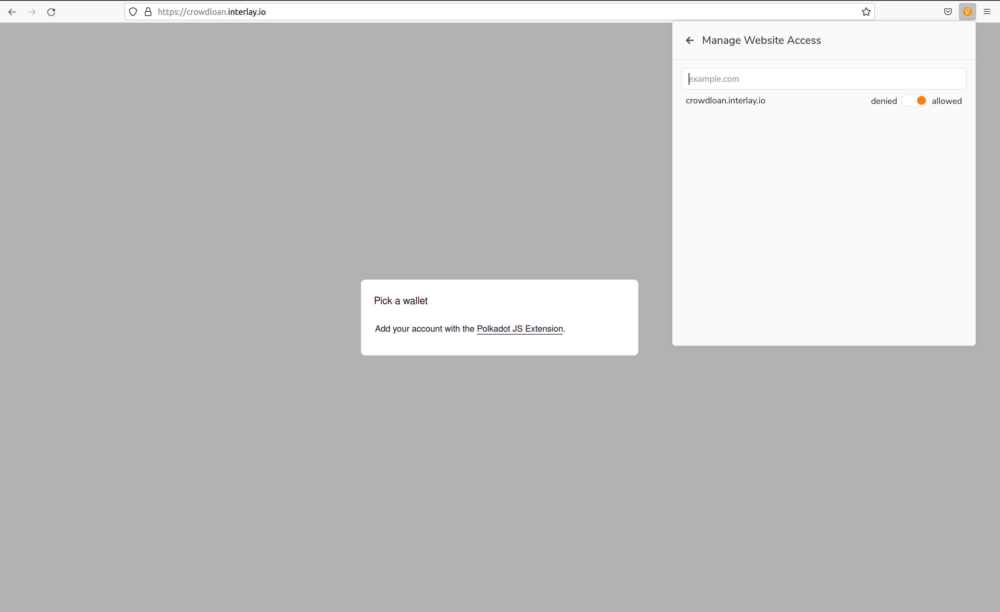

# FAQ

## General

### How does interBTC maintain its peg?

The interBTC bridge ensures that there is sufficient collateral locked to economically back minted interBTC.

### Who are the vaults? Can anyone become a Vault?

Vaults maintain the physical backing of interBTC: they ensure BTC remains locked while interBTC exists. Anyone can become a Vault. You only need: (1) a Bitcoin wallet, (2) a Polkadot wallet, and (3) to register by lock collateral (secures the BTC you get to hold in custody).

### Can I always get my BTC back?

interBTC guarantees that you will either (1) get you BTC back whenever you want, or (2) you will be reimbursed in collateral at a beneficial rate (current spot rate plus penalty fee incurred by the failed Vault).

### Why is the price of interBTC different to BTC?

interBTC might trade at a slight premium, driven by supply/demand for Bitcoin on Polkadot/Kusama (e.g., to cover issue fees). This is similar to diverging prices across different exchanges.

### Does interBTC require a price oracle?

interBTC guarantees that users (1) can redeem interBTC for BTC, or (2) are reimbursed in collateral at a beneficial rate in case of failure. A price oracle is needed to maintain a secure collateralization rate.

### Has interBTC been audited?

interBTC has been audited by the following companies:
- [NCC](https://www.nccgroup.com/)
- [Informal Systems](https://informal.systems/)
- [Quarkslab](https://www.quarkslab.com/)
- [SR Labs](https://www.srlabs.de/) (automatic testing, full audit in August 2022)

You can find all audit reports [here](https://github.com/interlay/audit-reports/blob/master/README.md)

### Why is interBTC better than other BTC bridges?

interBTC is based on XCLAIM - a top-tier, peer-reviewed research paper. interBTC is fully permissionless and decentralized: anyone can become a Vault without asking for permission and you can run your own Vault. interBTC uses collateralization and cross-chain SPV proofs to guarantee that users never face financial damage. Some projects rely on centralized parties, making them vulnerable to theft, seizure, and censorship. Other projects use techniques similar to interBTC, but are permissioned, rely on complex and non-battle-tested cryptographic protocols, or heavily rely on the price of their governance token for security of user funds.

## Issue

### Why does the interBTC app tell me that 0 interBTC can be issued at the moment?

There can be two reasons for this:

- **Reached maximum capacity**: If the capacity indicated on the [dashboard](https://testnet.interlay.io/dashboard) shows that the number of issued interBTC is equal to the capacity, you cannot issue more interBTC. Each interBTC must be backed by 150% worth of collateral and this represents the upper limit.

?> Testnet Note: The number of concurrent connections to our chain instances is restricted to monitor the load. Best course of action is to retry after some time/reload the website. We are looking to increase the load.

### I've sent too much BTC to a Vault during the issue process. What happens now?

**Verify that you sent too much** You can check if you sent too much BTC by checking your issue transaction in the "Transactions" page and with the link to the Bitcoin block explorer. The amount specified in the issue request (the one you entered when making the request) and the transferred BTC should match. If you indeed sent too much BTC, there are two options:

1. **A Vault has sufficient collateral to back the actual BTC sent**: If the selected Vault has sufficient collateral to issue IBTC/KBTC for the sent BTC, the size of the issue request is automatically increased. This means more collateral of the Vault is reserved. The user receives the amount corresponding to the received amount of BTC. The issue fee is deducted from the updated (increased) amount. You, as the user, do not need to do anything.
2. **A Vault does not have sufficient collateral to back the actual BTC sent**: If the Vault does not have sufficient collateral to issue the additional amount, only the amount that was originally requested is issued. A [refund request](https://spec.interlay.io/spec/refund.html) is sent to the Vault to return the surplus Bitcoin (excluding a fee). Note, however, that there is no penalty for the Vault if it does not return the surplus Bitcoin since this is a user fault rather than a Vault fault. You, as the user, do not need to do anything.

### I've sent too little BTC to a Vault during the issue process. What happens now?

**Verify that you sent too little** You can check if you sent too little BTC by checking your issue transaction in the "Transactions" page and with the link to the Bitcoin block explorer. The amount specified in the issue request (the one you entered when making the request) and the transferred BTC should match. If you indeed sent too little BTC, Vaults will not automatically execute your issue request.

**What you have to do**: Within 24 hours of making your issue request and after sending the BTC, you will have to manually claim your IBTC/KBTC. You can do this from the the "Transactions" page, opening the issue request you made. There should be a "Claim IBTC" or "Claim KBTC" button on the right-hand side.

**Rationale** The system allows you to underpay issue transactions, i.e., send too little BTC. Ultimately, your issue request reserved sufficient collateral so that the selected Vault can cover the originally request BTC. Hence, the Vault can also cover less BTC with its collateral.

However, in that case the Vault client does not automatically confirm your transaction. If you pay the exact amount the Vault client will automatically execute it on your behalf and you do not have to become active.
The reason for implementing it this way is to prevent others from "hijacking" your issue request. The Vault's Bitcoin address that you send your BTC to is public. Hence, anyone could just send the [minimum BTC amount (so-called dust)](https://bitcoin.stackexchange.com/a/41082/95148) to the Vault. Now assume that at the same time you are sending the BTC to the Vault as well. If the Vault would be able to automatically execute the request, the Vault could just execute the request with the dust amount, giving you the bare minimum IBTC/KBTC but would keep the BTC that you sent in addition. To prevent this, the user making the request has to execute the issue request if we detect underpayment.

## Redeem

### I am waiting 2 hours for my redeem request, why is it not fulfilled yet?

Vaults have 24 hours to complete redeem requests. The system is decentralized, i.e. we are not controlling the Vaults that are running. If Vaults are offline, i.e. the client is not running, redeem requests cannot be fulfilled.

### What happens if a Vault does not fulfill the redeem request within 24 hours?

You will have two options, both should leave you with a financial plus relative to the USD.

- **Retry**: You redeem with another vault. You will get a payment in the Vault's collateral that is slashed for the inconvenience. This will be much higher than your transaction cost so you will have a net plus.
- **Burn**: You can also burn your interBTC. In this case the financial value of your interBTC that you are burning is paid to you from the Vault's collateral plus the inconvenience fee similar to the retry. In USD terms this will also be a profit for you.

This will also be the case in production. Since the bridge is decentralized and anyone can run a Vault, we cannot enforce them to redeem. But what the system can and is doing, is reimbursing users and slashing Vaults for misbehavior.

?> Testnet Note: The number of failed redeems on the testnet will be likely much higher than on the production network since (1) there are no financial repercussions (we are using testnet collateral without real value) for Vaults, and (2) the Vault clients are undergoing improvements right now and we are working to get them to be operating stable in all edge cases.

## Parachain Error

### What does the Error security.ParachainOracleOfflineError mean?

Oracles need to submit up-to-date prices every hour. When the oracles are offline for an hour or longer, the interBTC bridge automatically goes to a halting mode. As a security measure, you cannot issue or redeem interBTC at that point.

?> Testnet Note: We are testing all parts of the system as part of the testnet. On mainnet, we will have a number of different oracle providers that should make this error very unlikely.

### What does the Error security.ParachainNotRunning mean?

The interBTC bridge protocols can be halted for a number of reasons. Halting means that users cannot issue or redeem at those points since we require an update to the chain. Reasons to halt the chain include oracles being offline or a Bitcoin fork.

## Polkadot.js Extension not detected on crowdloan.interlay.io

Sometimes Polkadot.js can act up. If you are getting `Pick a wallet. Add your account with the Polkadot JS Extension` even if you have Polkadot.js installed and have an active account, this is how to fix it:

1. In the Polkadot.js extension, go to "Settings" (Gear Icon)
2. Select "Manage Website Access" in the dropdown

3. Make sure "crowdloan.interlay.io" is set to "allowed"

4. Refresh the page

## More questions?

Reach out on [Discord](https://discord.gg/KgCYK3MKSf) or [open an issue](https://github.com/interlay/interbtc-docs/issues).
