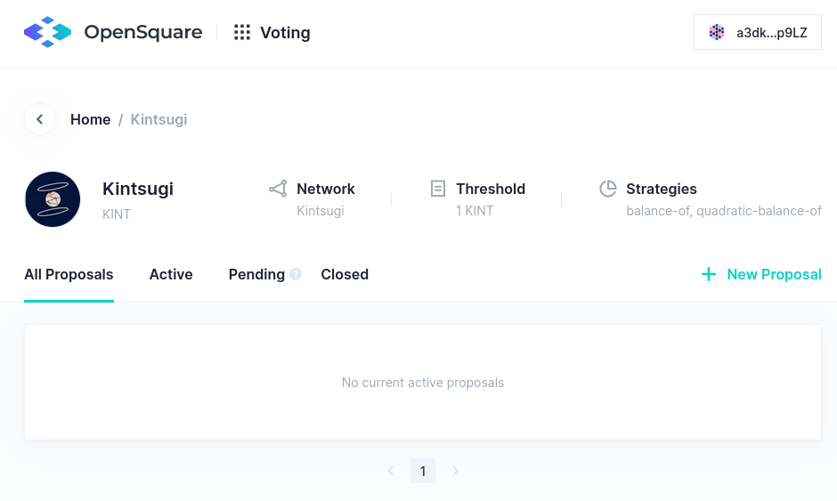
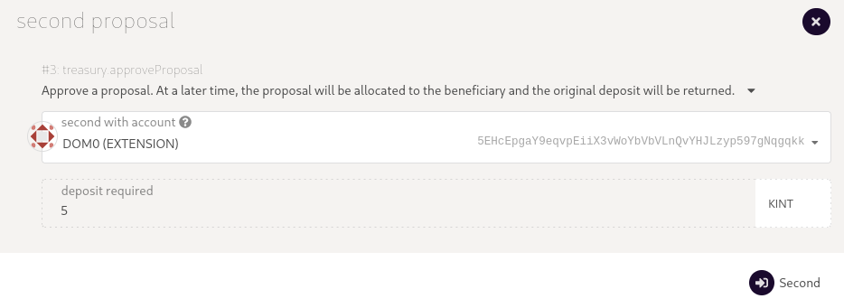
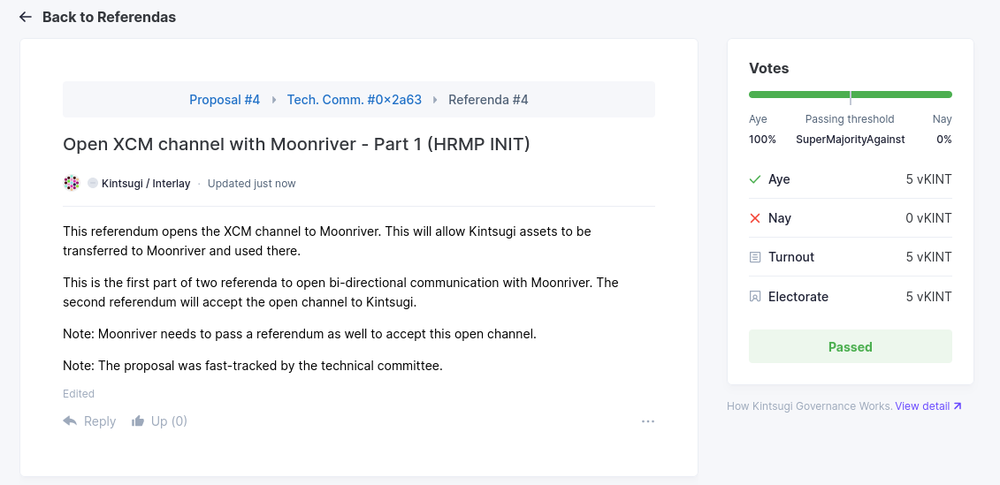
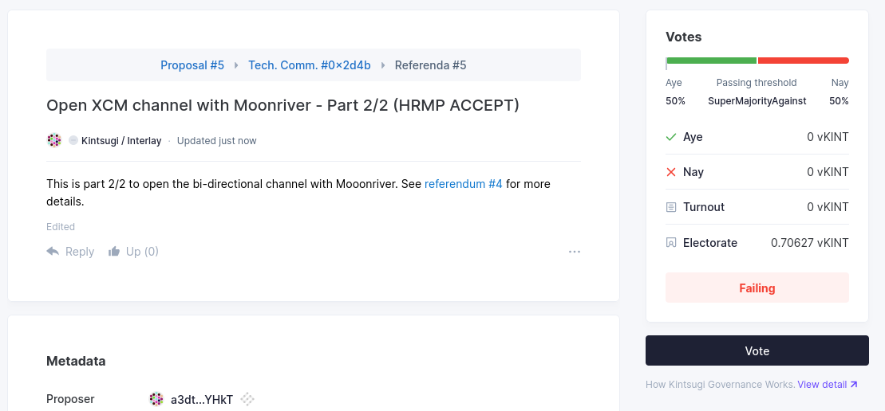
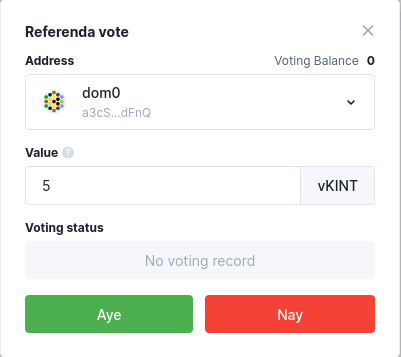
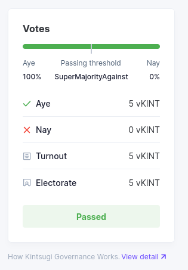
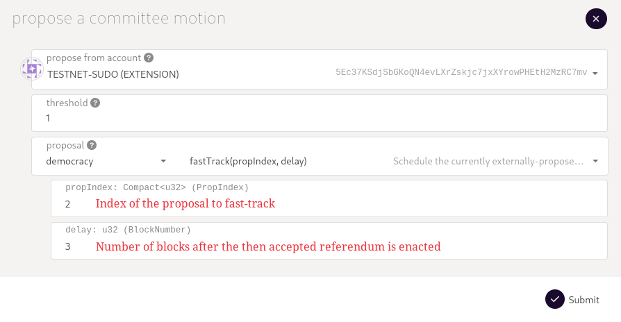

# Governance

Anyone can steer the development of the Kintsugi and Interlay networks.
Before participating, we recommend to learn about [Kintsugi's governance](kintsugi/governance).

Following this guide, you will learn the most important aspects of being active in governance:

- [x] [Gauging interest via an off-chain proposal](#off-chain-proposals)
- [x] [Creating a public proposal](#create-a-public-on-chain-proposal)
- [x] [Showing support for proposals to put them up for a referendum](#show-support-for-a-proposal)
- [x] [Creating a Treasury proposal](#create-a-treasury-proposal)
- [x] [Voting on referenda](#vote-on-referenda)
- [x] [Technical Committee: Fast-track a proposal](#fast-track-a-proposal)

### Required Tokens

The minimum vKINT/vINTR required to make a proposal in governance is as follows:

<!-- tabs:start -->

#### **Interlay (Mainnet)**

250 vINTR

#### **Kintsugi (Canarynet)**

5 vKINT

#### **Testnet-Kintsugi**

5 vKINT

#### **Testnet-Interlay**

5 vINTR

<!-- tabs:end -->

?> Before participating in governance, you will need to have staked your KINT or INTR tokens. Please follow [the guide](guides/stake).

## Off-Chain Voting

Off-chain proposals are a way to coordinate and gauge the communities opinion on a proposal before making an on-chain proposal. Since the entire process is off-chain, it's free to create proposals and to vote.

This process is recommended for new proposals and where members of governance are not sure if the community would agree with their proposal.

### OpenSquare

Go to https://opensquare.io/space/kintsugi/ to create and vote on off-chain proposals.

#### Creating a New Proposal

Connect the wallet in the top right and then click on "New Proposal" to create a new off-chain proposal.

#### Vote on a New Proposal

Connect the wallet in the top right and then select the proposal to vote on.

## Governance Platform

Both Kintsugi and Interlay use the SubSquare governance platform to discuss and vote on proposals.

?> **Important**: You need to convince the community that your proposal is useful and deserves backing. Only proposals with sufficient backing from the community go to vote. For this, you need to upload a description on SubSquare and participate in the discussion.

<!-- tabs:start -->

#### **Interlay (Mainnet)**

[interlay.subsquare.io](https://interlay.subsquare.io/)

#### **Kintsugi (Canarynet)**

[kintsugi.subsquare.io](https://kintsugi.subsquare.io/)

#### **Testnet-Kintsugi**

[test-kint.subsquare.io](https://test-kint.subsquare.io/)

<!-- tabs:end -->

#### 1. (Optional) Create an account

Subsquare requires an account or use your polkadot.js wallet.

If you want to use an account instead of your wallet, make sure to register or log-in:

#### 2. (Optional) Connect Polkadot/Kusama/Substrate account

If you used a traditional account instead of your web3 wallet, you need to link the account to a polkadot.js wallet.

Next, make sure you have a polkadot.js address linked when you go to your in the topbar -> Settings.

## On-Chain Proposal

Anyone can make a proposal if they have locked enough governance tokens.
This involves 2 steps:

1. Creating the on-chain proposal via Polkadot.js
2. Adding text/arguments/explanation to your proposal via the [governance platform](#governance-platform)

### Step 1: Submit Proposal via Polkadot.js

Governance can change the runtime code as well as all sorts of parameters. In the first step, decide what the proposal you are about to create should change.

?> We recommend you reach out to Interlay on [Discord](https://discord.com/invite/KgCYK3MKSf) in the #direction channel before creating a proposal.

Go to Governance -> Democracy -> Submit preimage and propose the change you desire. In the example below, we are setting the minimum required amount of KSM for Vaults to register to 1 KSM. Hit "Sign and Submit" to submit the preimage.

#### 2. Submit a Proposal

Go to Developer -> Chain State -> democracy -> preimages and unselect "include option". This will show all current preimages. Check the preimage with your account id (the `provider`) and note down the hash of the preimage.

Go to Governance -> Democracy -> Submit proposal and insert the preimage hash as well as the amount of vKINT/vINTR to lock for the proposal. The minimum required is automatically selected. Hit "Sign and Submit" to submit the proposal.

It takes some time and might require a hard-refresh (Ctrl + Shift + r) of the browser and eventually the proposal will show up in Governance -> Democracy.

### Step 2: Add Proposal Text

Now it is time to add the text, explaining and arguing in favor of your proposal.

?> **This is the most important part!** Kintsugi and Interlay are decentralized networks. You need to convince the community that your proposal is useful and deserves backing. Only proposals with sufficient backing from the community go to vote.

#### 1. Log into SubSquare

See [above](#governance-platform).
Make sure you have connected your Substrate account!

#### 2. Find and edit your proposal

Go to "Proposals" and select your proposal from the list.

?> If you connected the same account as the one you used to create the proposal, you will be able to add title and text.

## Show Support for a Proposal

Once a proposal is created, governance participants are asked to support proposals. One proposal per week is promoted to a referendum.

### Polkadot.js

Make sure you connect to the correct parachain in [polkadot.js.org/apps](https://polkadot.js.org/apps).
#### 1. Select a Porposal to Support

Go to Governance -> Democracy. If there are any ongoing proposal, you should see them listed on this page.

#### 2. Second a Proposal

From the list of the porposal, click "Second" and in the opened modal, click "Second" again to show support for the proposal.

#### 3. Confirm

Once you signed the extrinsic in step 2, you should see your account being listed in a "Seconds" dropdown in the list of proposal.

## Create a Treasury Proposal

Anyone can make a treasury proposal if they have locked enough KINT or INTR.

### Polkadot.js

Make sure you connect to the correct parachain in [polkadot.js.org/apps](https://polkadot.js.org/apps).

#### 1. Submit a Proposal

Go to Governance -> Treasury -> Submit proposal and propose who should receive funds from the Interlay or Kintsugi treasuries.

?> You will have to bond a fraction of the requested value in either KINT or INTR.

#### 2. Bring the Treasury Proposal to a Vote via a Public Proposal

As Kintsugi and Interlay do not have a council, the entire community has to agree on treasury spendings. This requires a public proposal. To achieve this, follow the steps of creating a public propsal.

A quick overview:

**Approve Proposal Preimage**

Select the treasury proposal id that should be approved.

**Submit Proposal**

Select the hash of the preimage and submit the proposal.

**Second the Proposal**

Last, second the proposal to give it a chance to become a referenda.

## Vote on Referenda

After a set number of blocks, the proposal with the highest backing staked governance tokens will be put up for a vote.
Once a proposal is decided to be voted on, it is called a *referendum*.

### SubSquare

You can see all referenda for Interlay at https://interlay.subsquare.io/democracy/referendums.

You can see all referenda for Kintsugi at https://kintsugi.subsquare.io/democracy/referendums.

#### 1. Make Sure you are Logged-In and Linked your Account

Make sure to log-in:

Next, make sure you have a web3 address linked when you go to your in the topbar -> Settings.

#### 2. Select a Referendum

First, click on the referendum you would like to vote on from the list of referenda.
You will see a description for the referendum, for example the one below:

#### 3. Vote on a Referendum

On the side of the referendum, you see a modal that will allow you to vote on the referendum with your staked governance tokens, i.e., vINTR or vKINT.

To place a vote, you will send an on-chain transaction locking the staked governance tokens for the period of the vote.
After the vote has passed, the staked governance tokens are returned to your account.

#### 4. Check the Vote Outcome

Once the voting period is over, you will see the result of the referendum in the same modal that you voted through.

## Fast-track a Proposal

If you are a member of the [Kintsugi Technical Committee](kintsugi/governance#technical-committee), you can propose to fast-track proposals.

- Go to Governance -> Tech. comm. -> Proposals -> Submit proposal
- Enter the id of the proposal which you propose to fast-track to a referendum
- Enter the delay for the enactment of the referendum. For almost instant enactment us a small block number like 3, for a large delay, use a larger number of blocks.

