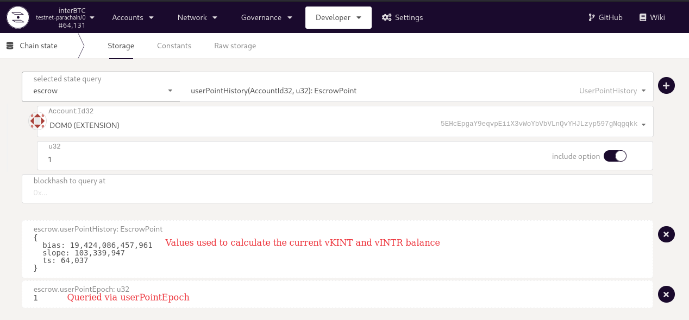
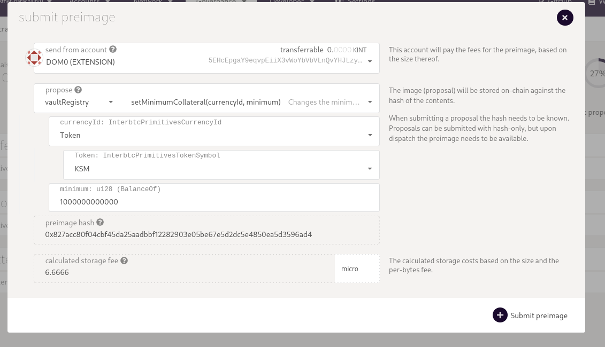
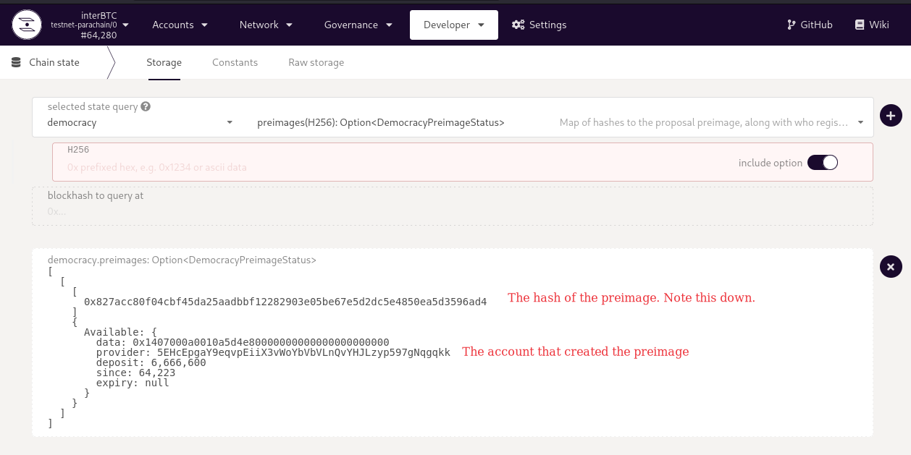
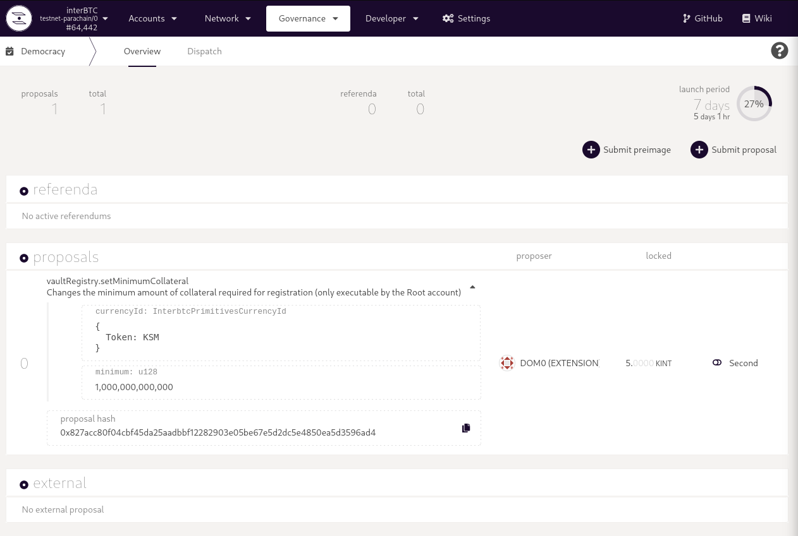

# Governance

Anyone can steer the development of the Kintsugi and Interlay networks.
Before participating, we recommend to learn about [Kintsugi's governance](kintsugi/governance).

Following this guide, you will learn the most important aspects of being active in governance:

- [x] Participating in [stake-to-vote](kintsugi/governance?id=stake-to-vote)
- [x] Making a public proposal
- [x] Showing support for proposals to put them up for a vote
- [x] Voting on referenda

## Participate in Stake-to-Vote

You can lock KINT/INTR to receive vKINT/vINTR. While you can lock any amount of KINT/INTR, below is a list of the minimum vKINT/vINTR required to make a proposal in governance:

<!-- tabs:start -->

#### **Testnet**

5 vKINT

#### **Kintsugi (Canarynet)**

5 vKINT

#### **Interlay (Mainnet)**

tbd vINTR

<!-- tabs:end -->

### App

Will be added soon.

### Polkadot.js (Advanced)

?> This is a low-level interface intended for advanced users.

Make sure you connect to the correct parachain in [polkadot.js.org/apps](https://polkadot.js.org/apps).

#### 1. Lock KINT/INTR

- Go to Developer -> Extrinsics -> escrow -> createLock
- Enter the `amount` of tokens you would like to lock. For KINT, convert by 1 KINT = 1 * 10^12 planck KINT. For example, if you want to lock 50 KINT, you would enter 50,000,000,000,000 planck KINT.
- Enter the time the KINT should be locked for. KINT will not be accessible before the lock expires. The `unlockHeight` is specified in numbers of blocks and rounds down to the closest week. One week is equal to 50,400 blocks. For example, if the chain is currently at block height 100,000 and you wish to lock tokens for 10 weeks, you would enter current block height + 10 weeks * 50,400 blocks = 100,000 + 10 * 50,400 = 604,000.
- Submit the extrinsic to lock the tokens.

#### 2. Check locked KINT/INTR

- Go to Developer -> Chain Sate -> escrow -> locked
- The `amount` is the KINT locked in planck KINT
- The `end` is the block number at which all KINT can be withdrawn

#### 3. Check vKINT/vINTR balance

The vKINT and vINTR balances decrease linearly over time.
To calculate the current balance, we use the following [formula](https://spec.interlay.io/spec/escrow.html#point):

`balance = bias - (slope * (now - height))`

- `now`: Go to Explorer and note down the current block height. This is the now value.
- `bias`, `height`, and `slope`: Go to Developer - Chain State -> escrow -> userPointEpoch and note down the current epoch. Then go to Developer - Chain State -> escrow -> userPointHistory and insert your account as well as the epoch from the previous step. This will give the current `bias` and `slope` as well as the `height` (see `ts`) in which tokens were locked.

In the example in the images, we have 500 KINT locked for four weeks. This results in:

19,424,086,457,961 - (103,339,947 * (64,100 - 64,037)) = 19,417,576,041,300 planck vKINT = 19.4 vKINT

<!-- ## Make a Treasury Proposal

### App

### Polkadot.js

Make sure you are corected to the correct parachain in [polkadot.js.org/apps](https://polkadot.js.org/apps).

#### 1. Navigate -->

## Make a Public Proposal

Anyone can make a proposal if they have locked enough governance tokens.
Make sure to follow the steps to [lock KINT or INTR to receive vKINT or vINTR](#participate-in-stake-to-vote).

### Polkadot.js

Make sure you connect to the correct parachain in [polkadot.js.org/apps](https://polkadot.js.org/apps).

#### 1. Submit a Preimage

Governance can change the runtime code as well as all sorts of parameters. In the first step, decide what the proposal you are about to create should change.

?> We recommend you reach out to Interlay on [Discord](https://discord.com/invite/KgCYK3MKSf) in the #direction channel before creating a proposal.

Go to Governance -> Democracy -> Submit preimage and propose the change you desire. In the example below, we are setting the minimum required amount of KSM for Vaults to register to 1 KSM. Hit "Sign and Submit" to submit the preimage.

#### 2. Submit a Proposal

- Go to Developer -> Chain State -> democracy -> preimages and unselect "include option". This will show all current preimages. Check the preimage with your account id (the `provider`) and note down the hash of the preimage.

- Go to Governance -> Democracy -> Submit proposal and insert the preimage hash as well as the amount of vKINT/vINTR to lock for the proposal. The minimum required is automatically selected. Hit "Sign and Submit" to submit the proposal.

- It takes some time and might require a hard-refresh (Ctrl + Shift + r) of the browser and eventually the proposal will show up in Governance -> Democracy.

## Show Support for a Proposal

### Polkadot.js

## Vote on a Referenda
