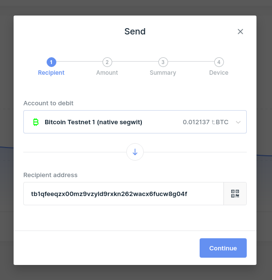
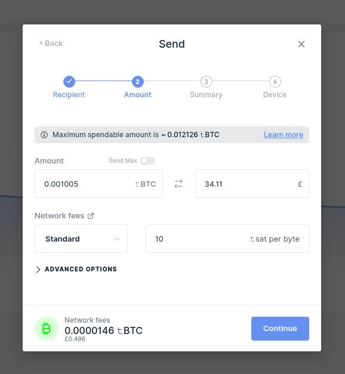
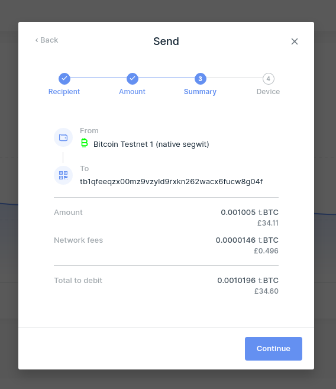
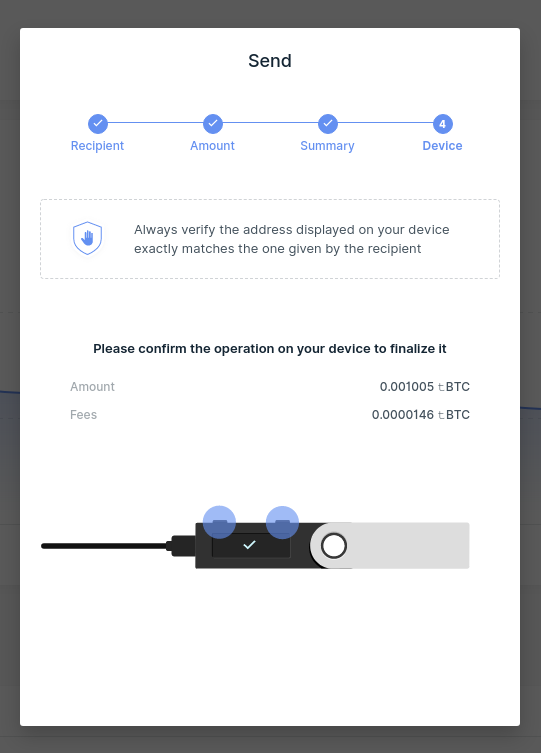
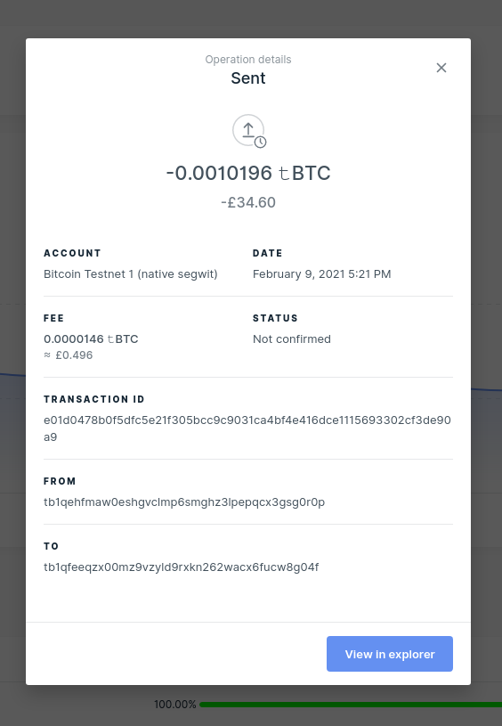
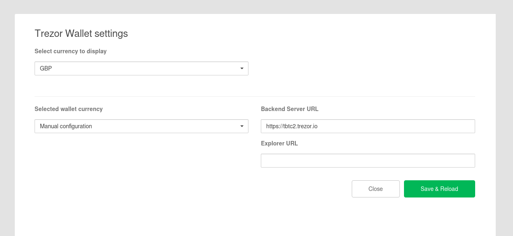
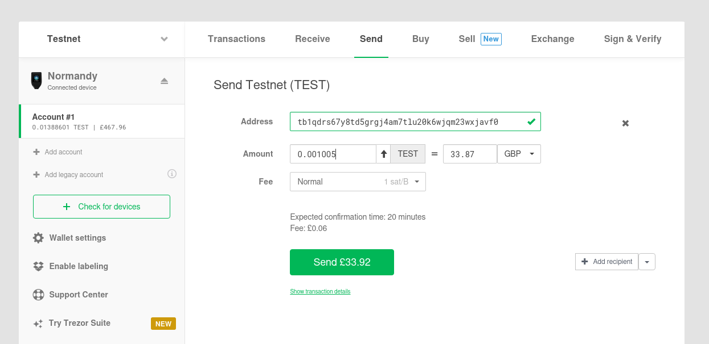
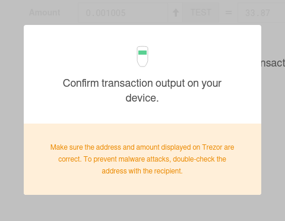

# Mint kBTC/interBTC (Testnet)

interBTC allows you to receive a representation of BTC to be used any way you see fit in the Polkadot ecosystem.
To get you started, follow this guide.

At the end of this guide you will have:

- [x] Locked BTC with a collateralized Vault
- [x] Issued your first interBTC on the interBTC app

## Video Guide (OLD UI - New Guide is WIP)

<iframe width="560" height="315" src="https://www.youtube.com/embed/hMZTj6ctGQE" frameborder="0" allow="accelerometer; autoplay; clipboard-write; encrypted-media; gyroscope; picture-in-picture" allowfullscreen></iframe>

## Prerequisites

Make sure you have the required [polkadot-js extension and a Bitcoin wallet](start/prereq.md).

## Issue interBTC

### 1. Go to [ testnet.interlay.io](https://testnet.interlay.io)

The app has 3 tabs: Issue, Redeem, and Transfer. Ensure you are on the Issue tab.

### 2. Get testnet DOT via the Faucet

Get some testnet DOT via the faucet with the "Request DOT" button, right-hand side of top bar, before making an issue request. You will need this to pay for the bridge transaction fees.

### 3. Enter the amount of interBTC you want to issue in the app

Enter the amount of interBTC you want to issue. The app will automatically select a Vault for you.

Check the details of your issue request and click **"Confirm"**. Sign the transaction via the `polkadot-js` extension when asked and wait a few moments.

### 4. Transfer BTC from your Bitcoin wallet to the Vault address

Use your Bitcoin wallet to transfer the specified `amount` to the given `address`.

#### Optional: use a hardware wallet

<b>Send BTC with the Ledger wallet</b>

To configure [Ledger Live](https://www.ledger.com/ledger-live) to work with Bitcoin testnet, go to `Setting` > `Experimental features` and enable `Developer mode`. Using the `Manager`, install the `Bitcoin testnet` app onto your device.

Enter the recipient address or scan the QR code. ([Support](https://support.ledger.com/hc/en-us/articles/360019123593-Send-crypto-assets))

Enter the amount - this may be auto-completed.

Review the summary and click **"Continue"**.

Confirm the recipient address, amount and fees on the device.

The receipt will show the transaction ID, click **"View in explorer"** to check whether your transaction is included in the Bitcoin network.

<b>Send BTC with the Trezor wallet</b>

To configure the [Trezor Wallet](https://wallet.trezor.io/#/) to work with Bitcoin testnet, go to the `Wallet Settings` and set `Backend Server URL` to `https://tbtc2.trezor.io`.

For up-to-date details please checkout the [Trezor Wiki](https://wiki.trezor.io/Bitcoin_testnet).

Enter the recipient address and amount manually or scan the QR code. ([User Manual](https://wiki.trezor.io/User_manual:Making_payments#Enter_the_destination_address_and_the_amount))

Confirm the recipient address, amount and fees on the device.

The payment will appear in the `Transactions` tab as unconfirmed. Once this is included in the Bitcoin network the status should update.
If configured, you may also check the status of the transaction in a block explorer.

### 5. Wait for confirmation of your BTC transaction and receive interBTC automatically

Once you made the payment, the app will automatically locate your transaction on the Bitcoin blockchain. If this transaction is correct, you can wait for a few minutes and you will receive your interBTC. This is because a Vault will eventually execute your request if your transaction has sufficient confirmations.

### 6. Optional: Manually claim your interBTC

You can check the status of your issue request in the [Transactions](https://testnet.interlay.io/transactions) view in the **"Issue Requests"** table. If your Bitcoin transaction has enough confirmations but has not been executed by a Vault yet, click on the issue request that is "Pending". This will open a modal, where you will see an **"Execute"** button. To finalize the Issue process and claim your interBTC, either wait for a Vault to auto-execute your request, or click **"Execute"** yourself.

## Questions?

- Checkout out the [FAQ](https://www.notion.so/interlay/Interlay-FAQ-5e3019b1cfd94f6693dc186e9640e607#277286bac5224dbbab565af4fe1ec5d5)
- Join our [Discord](https://discord.com/invite/KgCYK3MKSf)
