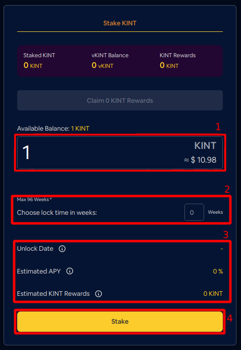
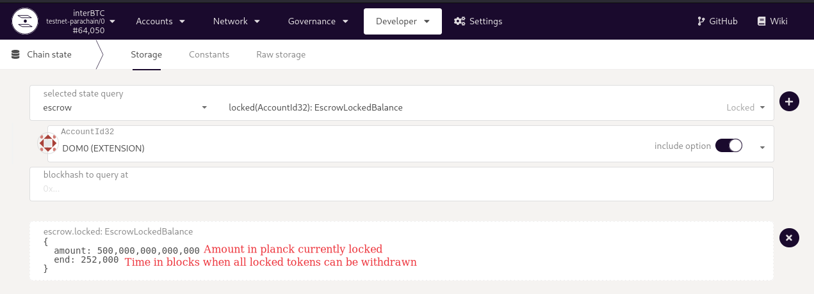
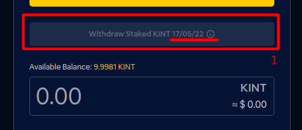
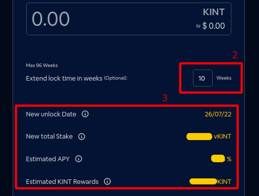

# Stake

Staking allows two things in the Kintsugi and Interlay networks:

- Participate in governance by obtaining vKINT tokens form staking KINT or vINTR tokens from staking INTR
- Earning staking rewards by locking KINT or INTR

Following this guide, you will learn:

- [x] [Staking your KINT/INTR tokens](#stake-kint-or-intr)
- [x] Extending your lock time to increase your vKINT/vINTR stake
- [x] Withdrawing staking rewards
- [x] Withdrawing staked KINT/INTR tokens

### Short Primer on Stake-to-Vote

When staking KINT or INTR to receive vKINT or vINTR, the amount of vKINT or vINTR received depends on two factors:

- **The amount of KINT/INTR staked**. The higher the amount of staked KINT/INTR, the more vKINT/vINTR is generated.
- **How long KINT/INTR is staked**. The longer KINT/INTR are staked, the more vKINT/vINTR is generated.

Read more about the motivation and principles in the [Governance](/getting-started/governance.md) section.

#### Important considerations

- Minimum staking duration is 1 week. Maximum staking duration = 2x parachain lease period (e.g. 96 weeks on Kintsugi and 192 weeks on Interlay).  You can stake in increments of 1 week (e.g. 2 weeks, 5 weeks, ...)

- You get 1 vINTR (or vKINT) if you stake 1 INTR (or KINT) for the maximum possible period. For reference, please check the maximum staking periods for [Kintsugi](kintsugi/governance#hard-facts) and [Interlay](interlay/governance#hard-facts).

```
1 vINTR = 1 INTR staked for 192 weeks (maximum staking duration on Interlay)
```

```
1 vKINT = 1 KINT staked for 96 weeks (maximum staking duration on Kintsugi)
```

- vKINT/vINTR amounts decrease linearly as time progresses, unless the lock is extended.

- The lock duration is **per account**! This means: if you lock 1 KINT/INTR to 48 weeks and want to add 100 KINT/INTR later, you have 2 options:

  - (A) Lock 100 KINT/INTR for 48 weeks or more
  - (B) Use another account to lock the 100 KINT/INTR for shorter durations

**Example**

- You **stake** `10` KINT for `96` weeks. This will get you `10` vKINT.
- In `48` weeks, you will have `5` vKINT left since `50%` of the lock period has passed.
- You **extend** your current lock by `24` weeks. You now have `7.5` vKINT since your KINT are locked for `(48+24) = 72` weeks and `72/96= 75%`.
- In 24 weeks, you will again have `5` vKINT (since the remaining lock is `48` weeks which is `50`% of the maximum lock period of `96` weeks).
- You **add** `10` KINT to your stake and **extend** the lock by 24 weeks. You now have ``15`` vKINT (``20 KINT x (48 + 24)/96 weeks``)
- If you now want to stake `100` KINT for `2 weeks` you will need to do this via a second account.

## Stake KINT or INTR

You can lock KINT/INTR to receive vKINT/vINTR. If you plan to participate in governance, please check the [minimum staking requirements per network](guides/governance#required-tokens).

### Using the App

The easiest way to stake KINT/INTR is via the Staking DApp!

<!-- tabs:start -->

#### **Interlay**

[app.interlay.io/staking](https://app.interlay.io/staking)

#### **Kintsugi**

[kintsugi.interlay.io/staking](https://kintsugi.interlay.io/staking)

#### **Testnet**

[testnet.interlay.io/staking](https://testnet.interlay.io/staking)
<!-- tabs:end -->

?> We use Kintsugi as example in the following - Interlay staking works the same.

1. In the staking app, enter the amount you want to stake.
3. Enter the staking period *in weeks*. Minimum 1 week, maximum 96 weeks for KINT and 192 weeks for INTR.
4. Review the unlock date and the reward estimates.

?> Note: The reward estimates may change as more or less people stake.

4. Click "Stake" and sign the transaction.



5. You can now see (a) the amount of staked KINT, (b) your voting power in vKINT (also used to calculate rewards), and (c) your staking rewards available for withdrawal.


!> **Risk vs Return**: The more and the longer you lock, the more rewards you can earn. However, once your tokens are staked you can only withdraw them at the end of the staking period. Please DYOR and familiarize yourself with the [risks of staking](https://cryptogeeks.org/risks-of-staking-crypto/).
### Polkadot.js (Advanced)
<details>
<summary>
Click to expand
</summary>

?> This is a low-level interface intended for advanced users.

Make sure you connect to the correct parachain in [polkadot.js.org/apps](https://polkadot.js.org/apps).

#### 1. Lock KINT/INTR

- Go to Developer -> Extrinsics -> escrow -> createLock
- Enter the `amount` of tokens you would like to lock. For KINT, convert by 1 KINT = 1 * 10^12 planck KINT. For example, if you want to lock 50 KINT, you would enter 50,000,000,000,000 planck KINT.
- Enter the time the KINT should be locked for. KINT will not be accessible before the lock expires. The `unlockHeight` is specified in numbers of blocks and rounds down to the closest week. One week is equal to 50,400 blocks. For example, if the chain is currently at block height 100,000 and you wish to lock tokens for 10 weeks, you would enter current block height + 10 weeks * 50,400 blocks = 100,000 + 10 * 50,400 = 604,000.
- Submit the extrinsic to lock the tokens.


#### 2. Check locked KINT/INTR

- Go to Developer -> Chain Sate -> escrow -> locked
- The `amount` is the KINT locked in planck KINT
- The `end` is the block number at which all KINT can be withdrawn



#### 3. Check vKINT/vINTR balance

The vKINT and vINTR balances decrease linearly over time.
To calculate the current balance, we use the following [formula](https://spec.interlay.io/spec/escrow.html#point):

`balance = bias - (slope * (now - height))`

- `now`: Go to Explorer and note down the current block height. This is the now value.
- `bias`, `height`, and `slope`: Go to Developer - Chain State -> escrow -> userPointEpoch and note down the current epoch. Then go to Developer - Chain State -> escrow -> userPointHistory and insert your account as well as the epoch from the previous step. This will give the current `bias` and `slope` as well as the `height` (see `ts`) in which tokens were locked.

In the example in the images, we have 500 KINT locked for four weeks. This results in:

19,424,086,457,961 - (103,339,947 * (64,100 - 64,037)) = 19,417,576,041,300 planck vKINT = 19.4 vKINT


</details>

## Extend Staking Lock

Use the staking app to extend your staking lock.

?> **Why should I extend my staking lock time?** The longer you stake your INTR/KINT, the more voting power (vINTR/vKINT) you have and hence the more rewards you will earn. Your vINTR/vKINT decreases as your remaining lock time decreases (the shorter the lock, the less vINTR/vKINT). To increase your vINTR/vKINT, you can extend your lock. See [above](#short-primer-on-stake-to-vote) for more info.

1. On the staking app, check how long your INTR/KINT is currently staked.



2. Enter by how many **weeks** you would like to extend your lock. Minimum extension = 1 week. Maximum = maximum lock period (96 weeks on Kintsugi; 192 weeks on Interlay) minus your current lock period.



3. Check the new unlock date and the estimated rewards. If you are happy with it, click the button below and sign the transaction.

Note: the interface will show you the maximum possible lock period if you try to enter a too long lock period.


## Withdraw Staking Rewards

Use the staking app to withdraw your staking rewards.

1. Check how many rewards you can withdraw.
2. Click "Withdraw" to claim your rewards.


## Withdraw Staked KINT or INTR

Use the staking app to withdraw your staked KINT/INTR **at/after the end of the lock period**.

?> You can always only withdraw your **entire** staked KINT/INTR at once at the end of the lock period. Partial withdrawals are not possible.

1. Check if you can withdraw your staked KINT/INTR.

Before staking period is over - **withdraw NOT possible**:


After staking period is over - **withdraw possible**:


2. Click "Withdraw" and sign the transaction.
