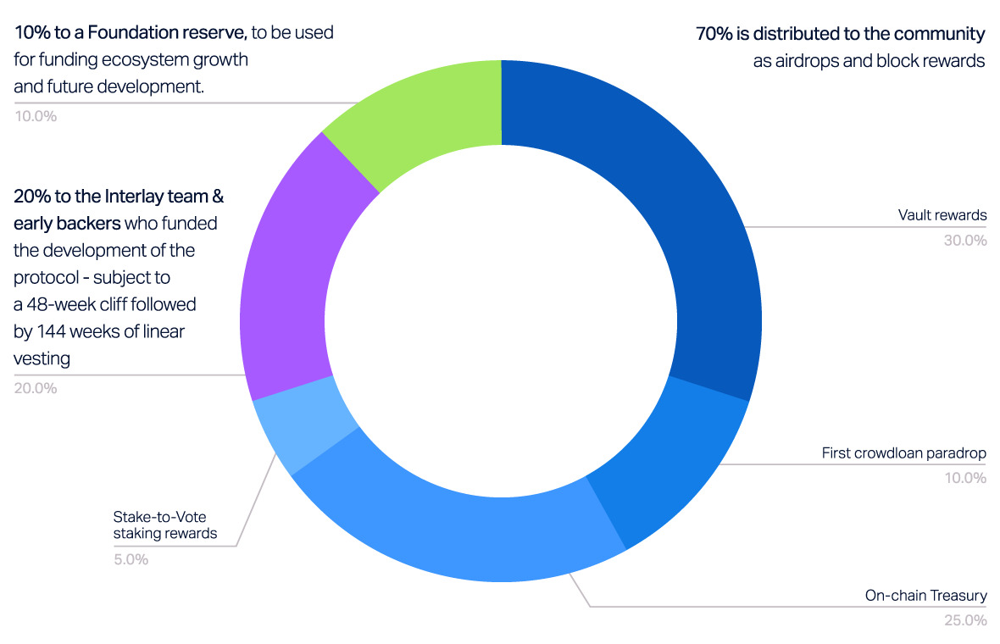

# INTR Tokenomics

Interlay will be governed by its community from day 1 - via INTR, Interlay’s governance token. 

?> _INTR tokens will be distributed to network participants, builders and early backers as airdrops and block-rewards. There will be no public sale or ICO._

Below is a summary of the Interlay token economy, as described in the [token economy whitepaper released by Kintsugi Labs](https://github.com/interlay/whitepapers).

## Key Functions of INTR

The INTR token’s main purposes are:

* **Governance**. INTR holders vote on governance proposals.
* **Staking**. To participate in governance, holders stake INTR and earn INTR staking rewards in return.
* **Utility**. Interlay will support transaction fee payments in INTR. 
* **Outlook**:  INTR will be tightly integrated into the bridge, offering token holders additional security and product benefits.

## Supply and Emission

INTR features an **unlimited supply**. The emission schedule is defined as follows: 

* 1 billion (1,000,000,000) INTR emitted over the first 4 years
* 2% annual inflation afterwards, indefinitely.

## Distribution

INTR will be controlled by the community:

* **70% is distributed to the community** as airdrops and block rewards.  
  - 30% as Vault rewards;
  - 10% as first crowdloan paradrop;
  - 25% to the on-chain Treasury;
  - 5% to stake-to-vote staking rewards.
* 20% to the Interlay team & early backers who funded the development of the protocol - subject to a 48-week cliff followed by 144 weeks of linear vesting.
* 10% to a Foundation reserve, to be used for funding ecosystem growth and future development.

Starting in year 5, the community receives 100% of newly minted INTR as part of the 2% annual inflation.

*For a detailed breakdown and explanation of the INTR distribution, check out the [token economy whitepaper released by Kintsugi Labs](https://github.com/interlay/whitepapers)*

## Emission and Vesting Schedules

<table>
<thead>
  <tr>
    <th>Allocation</th>
    <th>% of initial 4yr INTR Supply</th>
    <th>Emission</th>
    <th>Vesting / Distribution</th>
  </tr>
</thead>
<tbody>
  <tr>
    <td>1st crowdloan airdrop</td>
    <td>10%</td>
    <td>Airdrop shortly after parachain launch </td>
    <td>30% liquid when transfers are enabled, 70% linearly vested over parachain lease period (~96 weeks) </td>
  </tr>
  <tr>
    <td>On-chain Treasury (controlled by community governance)</td>
    <td>25%</td>
    <td>Allocation at launch</td>
    <td>No vesting</td>
  </tr>
  <tr>
    <td>Vault Rewards</td>
    <td>30%</td>
    <td>On a per-block basis</td>
    <td>No vesting</td>
  </tr>
  <tr>
    <td>Stake-to-Vote Rewards</td>
    <td>5%</td>
    <td>On a per-block basis</td>
    <td>No vesting</td>
  </tr>
  <tr>
    <td>Team &amp; early backers </td>
    <td>20%</td>
    <td>Airdrop shortly after parachain launch </td>
    <td>48 weeks lockup, followed by 144 weeks linear vesting. Internal investor vs team breakdown to be released. </td>
  </tr>
  <tr>
    <td>Foundation reserve (future development and ecosystem funding)</td>
    <td>10%</td>
    <td>Airdrop shortly after parachain launch </td>
    <td>Not liquid until spent. Vesting to be defined for each individual spend. </td>
  </tr>
</tbody>
</table>

### Circulating Supply

**Live circulating supply: [interlay.subscan.io](https://interlay.subscan.io/)** 

?> Circulating supply = liquid tokens that can be sold & purchased on the market. Excludes airdrop tokens that have not yet been claimed.

Due to the nature of the stake-to-vote governance mechanism of KINT, it is impossible to accurately predict the circulating supply (holds actively participating in governance may decide to stake KINT for prolonged periods). In addition, the reserves controlled by the on-chain treasury may be distributed to foster project development and ecosystem growth, as determined by community governance (KINT holders).

As such, the numbers below are **pure estimates and will very likely be subject to change over the first 2-3 years of the network's existence. Use with caution!**.

<table>
<thead>
    <tr style="text-align: right;">
      <th>Time (since parachain launch)</th>
      <th>% of total supply</th>
    </tr>
  </thead>
  <tbody>
    <tr>
      <td>Launch</td>
      <td>~3%</td>
    </tr>
    <tr>
      <td>6 months</td>
      <td>~4.4%</td>
    </tr>
    <tr>
      <td>1 year</td>
      <td>~7%</td>
    </tr>
    <tr>
      <td>2 years</td>
      <td>~30%</td>
    </tr>
  </tbody>
</table>

## Interlay Crowdloan

Interlay participated in the Polkadot parachain auctions and supported a crowdloan to enable the community to vote on when Interlay should go live. Voting worked by locking DOT on the Polkadot network.

Below is a summary of the Interlay crowdloan details, as described in the [token economy whitepaper released by Kintsugi Labs](https://raw.githubusercontent.com/interlay/whitepapers/master/Interlay_Token_Economy.pdf).

### Hard Facts

<table>
<tbody>
  <tr>
    <td>Auction start</td>
    <td>23 December 2021</td>
  </tr>
  <tr>
    <td>Crowdloan start</td>
    <td>~ 15 December 2021</td>
  </tr>
  <tr>
    <td>Parachain go-live (if winner)</td>
    <td>11 March 2022 (same for all)</td>
  </tr>
  <tr>
    <td></td>
    <td></td>
  </tr>
  <tr>
    <td>Target slot</td>
    <td>6 - 11 (Batch 2)</td>
  </tr>
  <tr>
    <td>Parachain lease period / DOT lockup </td>
    <td>96 weeks</td>
  </tr>
  <tr>
    <td>Crowdloan airdrop</td>
    <td>10% of the initial 4-year supply (100,000,000 INTR)</td>
  </tr>
  <tr>
    <td>Vesting</td>
    <td>30% available when transfers are enabled. 70% vests linearly over 96 weeks</td>
  </tr>
  <tr>
    <td>Airdrop distribution</td>
    <td>Proportional</td>
  </tr>
  <tr>
    <td>Crowdloan cap</td>
    <td>21,000,000 DOT soft cap if clear leader (50,000,000 DOT hard cap)   </td>
  </tr>
</tbody>
</table>

### Bonuses

<table>
<thead>
  <tr>
    <th>Bonus</th>
    <th>%</th>
    <th>Condition</th>
  </tr>
</thead>
<tbody>
  <tr>
    <td>Early bird</td>
    <td>10% </td>
    <td>Contribute before start of Auction #6 (23 December)</td>
  </tr>
  <tr>
    <td>Challenges   <b>(ends 23 December)</b></td>
    <td>2.5%  2.5% </td>
    <td>Solve Interlay quiz <a href="https://interlay.typeform.com/InterlayQuiz">(try now &#10148;)</a>  Mint interBTC on testnet <a href="https://testnet.interlay.io/">(try now &#10148;)</a> - MUST use <a href="https://wiki.polkadot.network/docs/learn-accounts">same account!</a> <i>Note: the challenge bonuses are updated every few days on the <a href="https://crowdloan.interlay.io/">Interlay network crowdloan page</a> - please be patient if you do not see the bonus right away.</i> </td>
  </tr>
  <tr>
    <td>Referral program</td>
    <td>5% </td>
    <td>each for the referrer and referred. <a href="https://wiki.polkadot.network/docs/learn-crowdloans#supporting-a-crowdloan-campaign">Minimum crowdloan</a> contribution required for both accounts.</td>
  </tr>
  <tr>
    <td>Kintsugi Legends</td>
    <td>2.5% </td>
    <td>If you contributed to Kintsugi crowdloan (MUST use <a href="https://wiki.polkadot.network/docs/learn-accounts">same account!)</td>
  </tr>
    <tr>
    <td>Strong supporters</td>
    <td>10% </td>
    <td>Contribute more than 50,000 DOT</td>
  </tr>
  <tr>
    <td><i>To be confirmed:</i> KBTC user bonus</td>
    <td>tbc</td>
    <td>Mint KBTC and/or run a Vault with collateral. Will be announced ad-hoc!</td>
  </tr>
</tbody>
</table>

Any INTR not used for the Early bird, Challenges, Referral, Kintsugi Legends, and Strong supporters airdrop will be distributed proportionally among all participants, further increasing the ratio of INTR per locked DOT.
