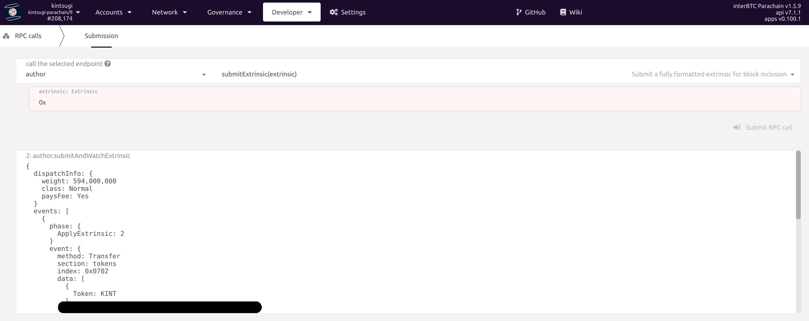

# Kintsugi Guides

Kintsugi network can be accessed in different ways:

- Official Dapp at [kintsugi.interlay.io](https://kintsugi.interlay.io): This is currently restricted to querying balances and making transfers.
- Polkadot.js: At launch, Kintsugi Network can be accessed via [Polkadot.js Apps](https://polkadot.js.org/apps/?rpc=wss%3A%2F%2Fapi-kusama.interlay.io%2Fparachain#/explorer). This is a very powerful tool, but it is not easy to use.

The guides below enable you to:

- [Claim KINT tokens from the crowdloan](/kintsugi/guides?id=claiming-kint-crowdloan-airdrop)
- [Check token balances (KINT, KSM, kBTC, etc.)](/kintsugi/guides?id=checking-balances)
- [Transfer (KINT, KSM, kBTC, etc.)](/kintsugi/guides?id=transfer-tokens)
- [Finding past transactions](/kintsugi/guides?id=find-a-transfer-transaction)
- [Understand and claim vested KINT](/kintsugi/guides?id=token-vesting)

?> More explorers and wallets will be added soon.


#### 2. View and Save Transaction Details


**Option 1: RPC Call Log**

1. Go to Developer > RPC Calls.
2. In the `author` endpoint (selected by default) you can see a list of events for your accounts.
3. **Copy and save the contents of the latest `author.submitAndWatchExtrinsic` text box on your PC (recommended)**. Alternatively, you can copy and save the block hash shown in `status > InBlock` at the bottom of the text box



The data in the box will look something like this:

```
{
  dispatchInfo: {
    weight: 594,000,000
    class: Normal
    paysFee: Yes
  }
  events: [
    {
      phase: {
        ApplyExtrinsic: 2
      }
      event: {
        method: Transfer
        section: tokens
        index: 0x0702
        data: [
          {
            Token: KINT
          }
          a3df.......FU
          a3ct.......tg
          100,000,000
        ]
      }
      topics: []
    }
    {
      phase: {
        ApplyExtrinsic: 2
      }
      event: {
        method: ExtrinsicSuccess
        section: system
        index: 0x0000
        data: [
          {
            weight: 594,000,000
            class: Normal
            paysFee: Yes
          }
        ]
      }
      topics: []
    }
  ]
  status: {
    InBlock: 0x73d7af.......
  }
}
```

It shows the list of events, including the `Transfer` you just made - here you can also see the sender and receiver accounts, and the amount of KINT sent (in pico KINT).

At the bottom of the box you will find the `status` and `InBlock` fields - this shows you the block hash of the block in which your transfer was included.

?> Use the block hash to search for the block in the [Netork tab](https://polkadot.js.org/apps/?rpc=wss%3A%2F%2Fapi-kusama.interlay.io%2Fparachain#/explorer) of Polkadot.js - for example, if you need help with your transaction.


**Option 2: Network Tab (manual search)**

1. Go to the [Netork tab](https://polkadot.js.org/apps/?rpc=wss%3A%2F%2Fapi-kusama.interlay.io%2Fparachain#/explorer) of Polkadot.js
2. Under `recent events` check the latest `tokens.Transfer` events to find your account (no search function available).+
3. **Save and click on the block number** next to your `tokens.Transfer` event. Note: this shows (a) the block number and (b) the index )(= position) of your transaction in that block (e.g.  index 0 means it is the first transaction).


## Find a Transfer Transaction

1. Go to the Kintsugi [Network tab](https://polkadot.js.org/apps/?rpc=wss%3A%2F%2Fapi-kusama.interlay.io%2Fparachain#/explorer) in Polkadot.js.
2. Enter the (A) block hash or (B) the block number of your transaction ([see above](/kintsugi/guides?id=_3view-and-save-transaction-details) - you need to save this when you make a transfer!).
3. You will see all events in that block. Check the `tokens.Transfer` events to find your transaction (no search function available yet).


