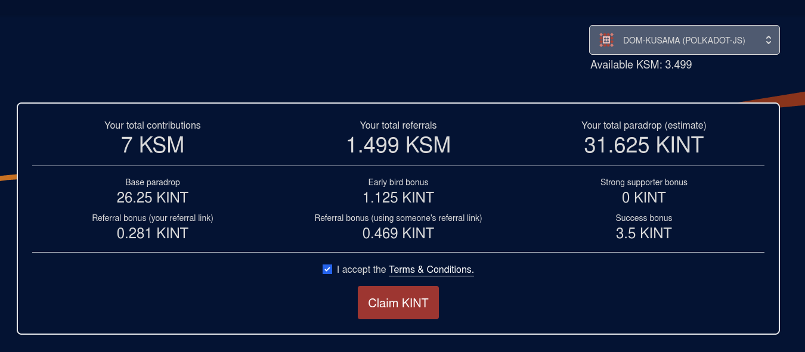
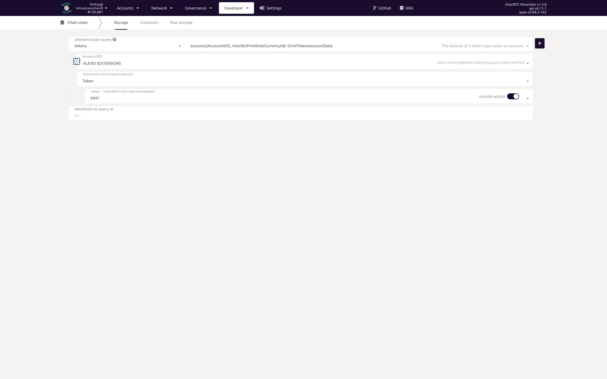
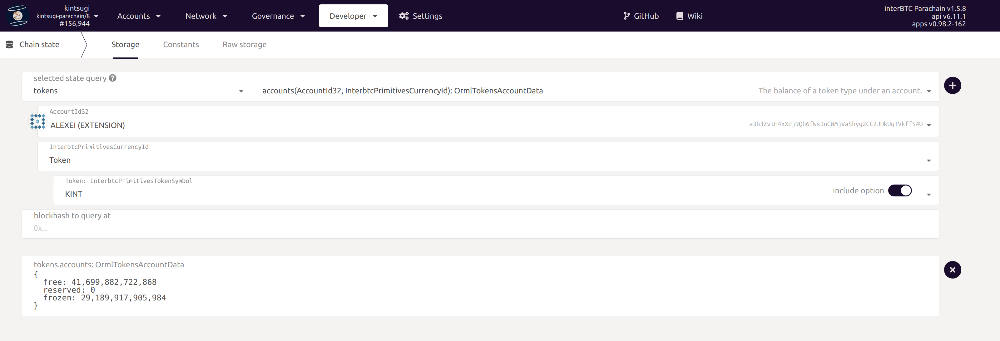

# Kintsugi Guides

At launch, Kintsugi Network can be accessed via [Polkadot.js Apps](https://polkadot.js.org/apps/?rpc=wss%3A%2F%2Fapi-kusama.interlay.io%2Fparachain#/explorer).

This is a very powerful tool, but it is not easy to use. Please follow the guides below.

?> Explorer and wallet support is WIP and will be added soon.


## Claiming KINT Crowdloan Airdrop

Follow this guide to claim KINT. This guide applies the following contributors:

* Contributions via https://kintsugi.interlay.io/, please use the account that you have used for the contribution
* Contributions via https://polkadot.js.org/apps/#/, please use the account that you have used for the contribution
* Contributions via the Bifrost SALP (https://bifrost.app/vcrowdloan?tab=ksm), please use the account that you have used for the contribution on the Bifrost app
* Contributions via the Fearless wallet. Here, **you must first import you Fearless account into Polkadot.js**. The Fearless team has prepared a [guide](https://wiki.fearlesswallet.io/accounts/walkthrough/exporting-and-importing-a-wallet-using-a-passphrase).

Other contributions, e.g., via exchanges will airdrop KINT tokens through other means. If you have contributed via any other means than the ones listed above, please contact the provider of the contribution for the KINT airdrop.

#### 1. Go to the KINT claim website at [ https://kintsugi.interlay.io/](https://kintsugi.interlay.io/)

Scroll down to the claim form. If you have contributed to the Kintsugi crowdloan, you will see your estimated KINT airdrop together with your KSM locked.

You MUST read and accept the terms and conditions to qualify for the airdrop.



#### 2. Sign the Terms and Conditions by clicking the "Claim KINT" button

You will be asked to sign the terms and conditions via the polkadot.js extension.

?> There are **no** transaction fees for signing the T&Cs.


#### 3. Successfully claimed KINT

**It may take up to 48 hours** to see and access your KINT in your wallet. Thank you for participating.


## Update Metadata in Polkadot.js 

Once in a while there are updates that require reloading metadata so Polkadot.js can properly interact with the Kintsugi parachain through your browser.

To update metadata, go to the "Settings" > "Metadata" tab. 

There are two cases:

(A) If you see the "Update metadata" button, click it and confirm if the modal that will open.

(B) If you do not see any button, wait for 1-2 seconds. You will see the QR code changes.

?> In most cases, there is no "update" button -  **the QR code will change automatically**. This means the metadata was updated.


## Checking KINT Balance

Withing ~48 hours of accepting the T&Cs and submitting the claim form, you should receive airdropped tokens in you account. Follow these steps to check your balance.

### Polkadot.js Account Page

Go to the [Kintsugi Polkadot.js Accounts page](https://polkadot.js.org/apps/?rpc=wss%3A%2F%2Fapi-kusama.interlay.io%2Fparachain#/accounts).
You can see you balances in the `balances` colum.
Click on the arrow to see locked versus transferrable amounts.

!> Make sure that you select the Kintsugi Labs node. OnFinality node is not yet upgraded to the latest version v1.5.10! 

?> If your account is not showing up in Polkadot.js you may need to [import it](https://support.polkadot.network/support/solutions/articles/65000176241-how-to-import-a-private-key-from-another-wallet-to-polkadot-js).

### Sub.id

The simplest way to see your KINT balance (and balances of other tokens that you have on the Kintsugi parachain) is currently through [Sub.id by Subsocial](https://sub.id/#/).

Go to [sub.id](https://sub.id/#/) and enter your account.


### Polkadot.js Developer Tab (Advanced)

More advanced users can use Polkadot.js developer tools to check the account balance.

!> Polkadot.js Accounts tab will **not show your KINT balance**. Kintsugi has a generic multi-currency pallet, which allows adding any token easily. However, Polkadot.js does not support this - yet. **Follow the instructions below to view your KINT balance via Polkadot.js Developer tab**


#### View Balance in Developer > Chain state > Token

In the "Developer" tab select "Chain state".


Then, in the dropdown, select the "token" pallet.


Select your Account in the top-level dropdown, and select "KINT" in the currency selector dropdown (see image).

Then click "+" in the top right of the form.




You will now see your KINT balance as follows:



?> Amounts are shown in **pico KINT** - the smallest currency unit on Kintsugi. To get to the actual KINT **divide by 1,000,000,000,000** (remove 12 decimal points). This is a Polkadot.js feature.

- **free** shows your **total KINT balance**
- **frozen** shows how much of your KINT are **still vesting**


?> `Available for transfer` = `free` - `frozen`

## Transfer KINT

?> Important: At the end of the transfer, write down / store the block hash of your transaction! (see [Step 3 below](kintsugi/guides?id=_3-transfer-kint-in-developer-gt-extrinsics-gt-tokens)). **Do not close the browser / tab before you do this!** Otherwise you will need to manually find your transaction in Polkadot.js.

?> You need to keep a very small amount of KINT (0.000,000,001 KINT or 1000 pico KINT) in your account as existential deposit (for now).


?> You can only transfer tokens that have unlocked! `Available for transfer` = `free` - `frozen`


#### Transfer KINT in Developer > Extrinsics > Tokens

1. To transfer KINT, select "Extrinsics" in the "Developer".

2. In the dropdown, select the "tokens" pallet.

3. Select the `transfer()` function. If you want to transfer all available tokens, you can use `transferAll()` - but be careful!

?> Important: You need to use `transfer()`, not `forceTransfer()`. Otherwise you will get a `BadOrigin` error.

4. Enter the source account.
   
5. Enter the destination account.

6. Select "KINT" in the "Token" dropdown.

7. Enter the amount **in pico KINT (1 KINT = 1,000,000,000,000 pico KINT)**.
   
8. Press "Sign Transaction". In the opened modal, enter your account password, and then click "Sign and Submit".


You will see a green success message after 10-20 seconds in the top right if the transfer was successful.


?> Reminder: 1 KINT = 1,000,000,000,000 pico KINT (12 zeroes).


!> Important: write down / save the block hash of your transaction!

#### 2. View and Save Transaction Details


**Option 1: RPC Call Log**

1. Go to Developer > RPC Calls.
2. In the `author` endpoint (selected by default) you can see a list of events for your accounts.
3. **Copy and save the contents of the latest `author.submitAndWatchExtrinsic` text box on your PC (recommended)**. Alternatively, you can copy and save the block hash shown in `status > InBlock` at the bottom of the text box


The data in the box will look something like this:

```
{
  dispatchInfo: {
    weight: 594,000,000
    class: Normal
    paysFee: Yes
  }
  events: [
    {
      phase: {
        ApplyExtrinsic: 2
      }
      event: {
        method: Transfer
        section: tokens
        index: 0x0702
        data: [
          {
            Token: KINT
          }
          a3df.......FU
          a3ct.......tg
          100,000,000
        ]
      }
      topics: []
    }
    {
      phase: {
        ApplyExtrinsic: 2
      }
      event: {
        method: ExtrinsicSuccess
        section: system
        index: 0x0000
        data: [
          {
            weight: 594,000,000
            class: Normal
            paysFee: Yes
          }
        ]
      }
      topics: []
    }
  ]
  status: {
    InBlock: 0x73d7af.......
  }
}
```

It shows the list of events, including the `Transfer` you just made - here you can also see the sender and receiver accounts, and the amount of KINT sent (in pico KINT).

At the bottom of the box you will find the `status` and `InBlock` fields - this shows you the block hash of the block in which your transfer was included. 

?> Use the block hash to search for the block in the [Netork tab](https://polkadot.js.org/apps/?rpc=wss%3A%2F%2Fapi-kusama.interlay.io%2Fparachain#/explorer) of Polkadot.js - for example, if you need help with your transaction.


**Option 2: Network Tab (manual search)**

1. Go to the [Netork tab](https://polkadot.js.org/apps/?rpc=wss%3A%2F%2Fapi-kusama.interlay.io%2Fparachain#/explorer) of Polkadot.js
2. Under `recent events` check the latest `tokens.Transfer` events to find your account (no search function available).+
3. **Save and click on the block number** next to your `tokens.Transfer` event. Note: this shows (a) the block number and (b) the index )(= position) of your transaction in that block (e.g.  index 0 means it is the first transaction).


## Find a Transfer Transaction

1. Go to the Kintsugi [Network tab](https://polkadot.js.org/apps/?rpc=wss%3A%2F%2Fapi-kusama.interlay.io%2Fparachain#/explorer) in Polkadot.js.
2. Enter the (A) block hash or (B) the block number of your transaction ([see above](/kintsugi/guides?id=_3view-and-save-transaction-details) - you need to save this when you make a transfer!).
3. You will see all events in that block. Check the `tokens.Transfer` events to find your transaction (no search function available yet).


## Token Vesting

### Vesting Schedule: Per Block

KINT received via the crowdloan airdrop are subject to vesting.
Vesting stared on 13 October (when Kintsugi won a parachain) and happens **per block**.

Your vested tokens are shown as "locked" or "frozen" (depending on the wallet/platform).

### How many tokens should I have unlocked?

You can calculate based on this formula:

`my_tokens x 0.3 + (tokens x 0.7 x days_since_13oct2021 / 336)`

where `my_tokens` is the total amount of KINT you received in the airdrop and `days_since_13oct2021` is the number of days that passed since 13 October 2021 when vesting started.

### Claim via Polkadot.js Developers Tab
To receive your unlocked tokens, you need to make a transaction on the Kintsugi parachain.

To claim the latest unlocked tokens, do the following:

1. Go to "Developers" > "Extrinsics"
2. Select "vesting" in the extrinsic dropdown
3. Select the "claim()" function
4. Submit Transaction

If you had tokens that have unlocked, you will see them in your balance.