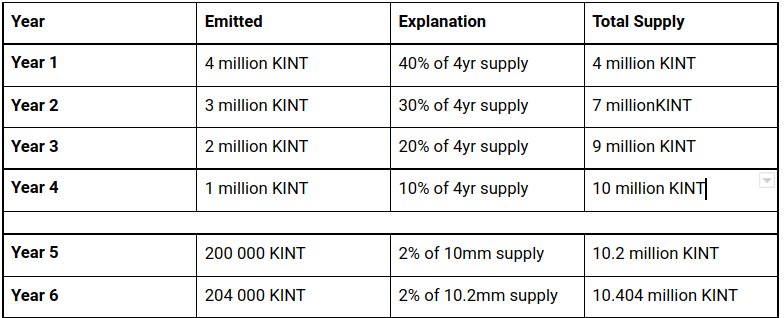

# KINT Tokenomics

Kintsugi will be governed by its community from day 1 - via KINT, Kintsugi’s governance token. Kintsugi will go live via **a fair launch scheme**. 

_KINT tokens will be distributed to network participants, builders and early backers as airdrops and block-rewards. There will be no public sale or ICO._

Below is a summary of the Kintsugi token economy, as described in the [token economy whitepaper released by Kintsugi Labs](https://raw.githubusercontent.com/interlay/whitepapers/master/Kintsugi_Token_Economy.pdf).

### Key Functions of KINT

The KINT token’s main purposes are:

* **Governance**- KINT holders vote on governance proposals and elect council members to make operational decisions. 
* **Utility**. Mit-term, Kintsugi will support transaction fee payments in KINT and other digital assets, in addition to KSM. 

### Supply and Emission

KINT features an unlimited supply. The emission schedule is defined as follows: 

* 10 million KINT emitted over the first 4 years (4:3:2:1 million) 
* 2% annual inflation afterwards, indefinitely.

Specifically, the emission schedule for the first 6 years looks as follows:

### Distribution

KINT will be controlled by the community:

* **70% is distributed to the community** as airdrops and block rewards.  
  - 40% to Vault rewards;
  - 35% to the on-chain Treasury;
  - 5% to stake-to-vote staking rewards.
* 30% is airdropped to the Interlay team, and early & future investors, who funded development of the protocol - subject to 1 year followed by 1 year linear vesting.

Starting in year 5, only the community receives new KINT from the annual inflation.

<table>
  <tr>
   <td>

Distribution of the initial 4-year supply.
   </td>
   <td>

Distribution of the 2% annual inflation starting in year 5.
   </td>
  </tr>
</table>

**Suggested On-Chain Treasury Reserve**

The on-chain Treasury reserve is in turn distributed as follows (suggestion - final allocation to be decided, from time to time, by Kintsugi community governance):

**Full Tokenomic Details**

*For a detailed breakdown and explanation of the KINT distribution, check out the [token economy whitepaper released by Kintsugi Labs](https://raw.githubusercontent.com/interlay/whitepapers/master/Kintsugi_Token_Economy.pdf)*

### Vesting Schedules

<table>
<thead>
  <tr>
    <th colspan="2">Allocation</th>
    <th>% of initial 4yr KINT Supply</th>
    <th>Vesting / Distribution</th>
  </tr>
</thead>
<tbody>
  <tr>
    <td rowspan="6">On-Chain Treasury</td>
    <td>1st crowdloan</td>
    <td>10%</td>
    <td>30% liquid, 70% linearly vested over 48 weeks. Vesting start date backdated to parachain launch (13 October 2021).</td>
  </tr>
  <tr>
    <td>Crowdloan in-protocol rewards</td>
    <td>2%</td>
    <td>No vesting.</td>
  </tr>
  <tr>
    <td>Crowdloan reserve</td>
    <td>5%</td>
    <td>To be defined individually for each new crowdloan. </td>
  </tr>
  <tr>
    <td>LP rewards</td>
    <td>8%</td>
    <td>No vesting.</td>
  </tr>
  <tr>
    <td>Ecosystem reserve</td>
    <td>5%</td>
    <td>No vesting - unless determined by governance for specific allocations / grants. </td>
  </tr>
  <tr>
    <td>Rainy Day Reserve</td>
    <td>5%</td>
    <td>No vesting. </td>
  </tr>
  <tr>
    <td colspan="2">Vault Rewards</td>
    <td>30%</td>
    <td>No vesting. Distributed on a per-block basis. Early rewards highest, decreasing over 4 years. 30% of tota 4yr allocation in year 1, 30% in year 2, 20% in year 3, remaining 10% in year 4. After 4 years, Vaults receive 40% of the annual inflation.&nbsp;&nbsp;</td>
  </tr>
  <tr>
    <td colspan="2">Stake-to-Vote</td>
    <td>5%</td>
    <td>No vesting. Distributed on a per-block basis.</td>
  </tr>
  <tr>
    <td rowspan="2">Team &amp; Investors</td>
    <td>Current &amp; future team &amp; current investors </td>
    <td>20%</td>
    <td>48 weeks lockup, followed by 48 weeks linear vesting. Internal investor vs team breakdown to be released. </td>
  </tr>
  <tr>
    <td>Reserve (future development and ecosystem funding)</td>
    <td>10%</td>
    <td>No liquid until spent. Vesting to be defined for each individual spend. </td>
  </tr>
</tbody>
</table>

### Circulating Supply

Due to the nature of the stake-to-vote governance mechanism of KINT, it is impossible to accurately predict the circulating supply (holds actively participating in governance may decide to stake KINT for prolonged periods). In addition, the reserves controlled by the on-chain treasury may be distributed to foster project development and ecosystem growth, as determined by community governance (KINT holders). 

As such, the numbers below are **pure estimates and will very likely be subject to change over the first 2-3 years of the network's existence. Use with caution!**.

<table border="1" class="dataframe">
  <thead>
    <tr style="text-align: right;">
      <th></th>
      <th>Time (since parachain launch)</th>
      <th>in days</th>
      <th>~Circulating KINT</th>
      <th>~% of total supply</th>
    </tr>
  </thead>
  <tbody>
    <tr>
      <td>Launch</td>
      <td>1</td>
      <td>367000</td>
      <td>3.7%</td>
    </tr>
    <tr>
      <td>1 month</td>
      <td>30</td>
      <td>571000</td>
      <td>6%</td>
    </tr>
    <tr>
      <td>2 months</td>
      <td>60</td>
      <td>782000</td>
      <td>8%</td>
    </tr>
    <tr>
      <td>3 months</td>
      <td>90</td>
      <td>992000</td>
      <td>10%</td>
    </tr>
    <tr>
      <td>4 months</td>
      <td>120</td>
      <td>1203000</td>
      <td>12%</td>
    </tr>
    <tr>
      <td>5 months</td>
      <td>150</td>
      <td>1414000</td>
      <td>14%</td>
    </tr>
    <tr>
      <th>6</th>
      <td>6 months</td>
      <td>180</td>
      <td>1625000</td>
      <td>16%</td>
    </tr>
    <tr>
      <td>1 year</td>
      <td>360</td>
      <td>2890000</td>
      <td>29%</td>
    </tr>
    <tr>
      <td>2 years</td>
      <td>720</td>
      <td>6645000</td>
      <td>66%</td>
    </tr>
  </tbody>
</table>

